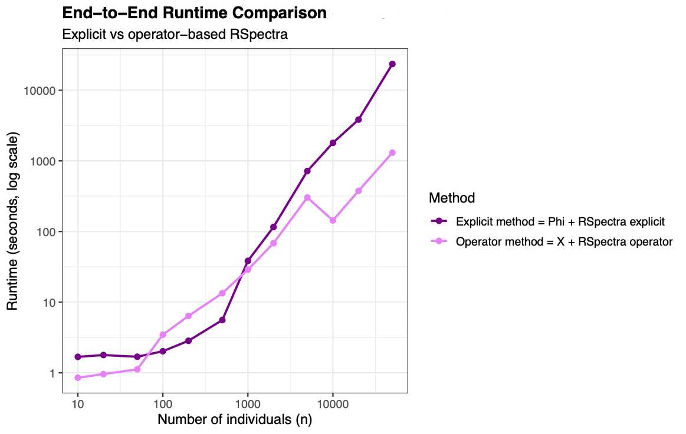
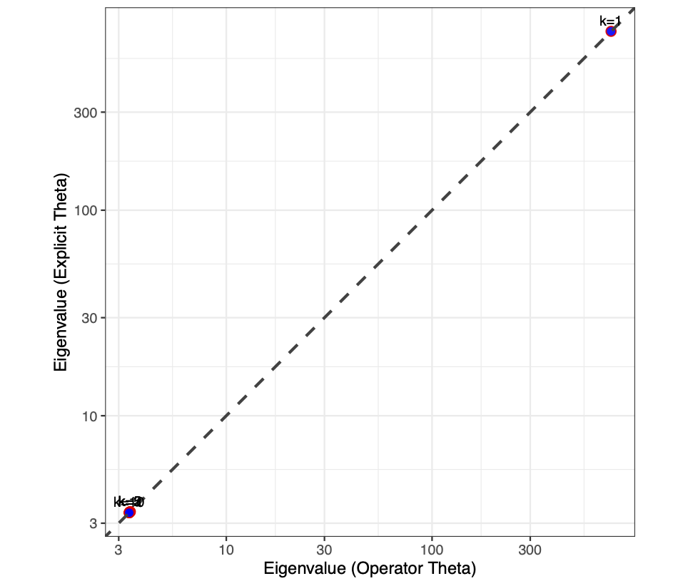
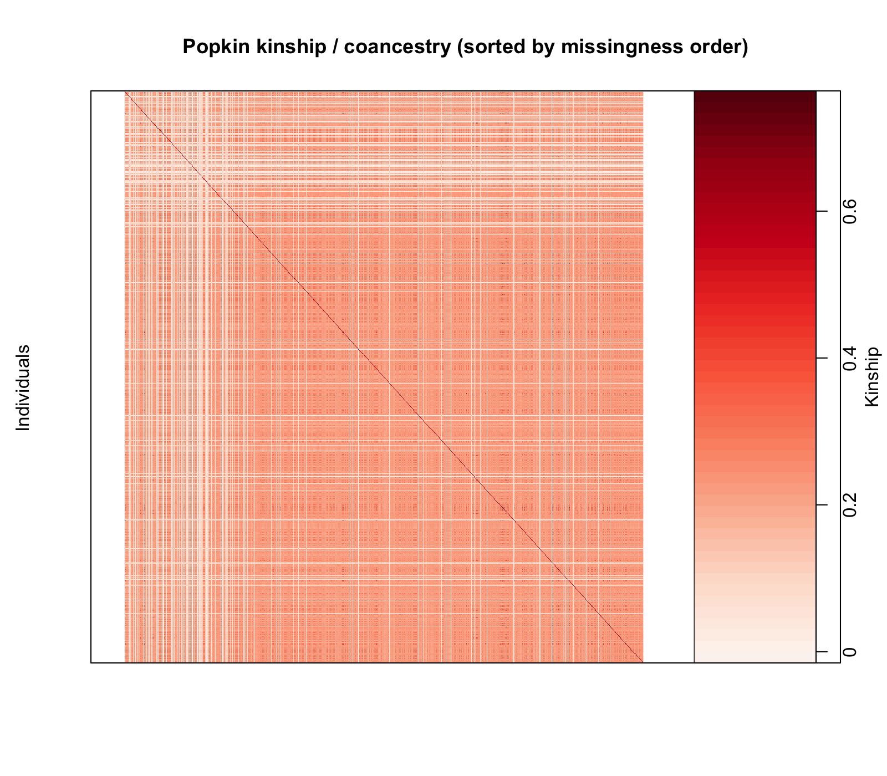

# Master's Project: Scalable Calculation of the Top K Eigenvectors and Eigenvalues of the Popkin Kinship Matrix Estimate

**Author:** Isabella Xu  
**Advisor:** Dr. Alejandro Ochoa, Duke University  
**Repository:** [isabella-x9/admix-popkin-masters](https://github.com/isabella-x9/admix-popkin-masters)  

---

## Overview

This repository contains code for a Master's Project in Biostatistics at Duke University. 

This project develops computational methods for **scalable eigendecomposition of the Popkin kinship matrix**, a relatedness estimator used in population genetics and admixture inference. 

Modern genomic datasets often contain **large numbers of individuals (n)** and **millions of genetic markers (m)**. Many downstream analyses rely on computing eigenvalues and eigenvectors of the kinship matrix to study population structure.

However, explicitly constructing the kinship matrix requires storing an **n × n dense matrix**, which becomes computationally expensive for large datasets.

This project evaluates a **coancestry-free operator formulation** that allows iterative eigensolvers to compute the top *K* eigenvalues and eigenvectors **without constructing the full coancestry matrix explicitly**.

The project compares two implementations using the **RSpectra** eigensolver: 

- **Explicit matrix approach** — construct the Popkin kinship matrix directly
- **Operator-based approach** — compute matrix–vector products without forming the coancestry matrix 

The goal is to determine whether the operator formulation provides **scalable performance while maintaining numerical accuracy**. 


---

## Repository Structure 
```
admix-popkin-masters/
│
├── admix-popkin-masters.Rproj
├── README.md
│
├── data/
│   Input genotype datasets used for experiments
│
├── scripts/
│   Core analysis pipeline
│   │
│   ├── 01_build_popkin_grm.R        # Compute Popkin kinship components
│   ├── 02_popkin_evd.R              # Explicit eigendecomposition
│   │
│   ├── 03_eigs_*.R                  # Eigenvalue computations
│   │
│   ├── 04_*                         # Runtime scaling experiments
│   │   ├── simulate genotype data
│   │   ├── compute Popkin parameters
│   │   └── run RSpectra eigensolver
│   │
│   ├── 05_plot_*.R                  # Runtime and scaling visualizations
│   ├── 06_plot_*.R                  # Eigenvalue / eigenvector diagnostics
│   │
│   ├── 07_missingness_M_real.R      # Real data missingness analysis
│   └── Phi_prod.R                   # Matrix–vector product operator
│
├── output/
│   Intermediate results and experiment outputs
│   │
│   ├── eigenvalues / eigenvectors
│   ├── runtime benchmarks
│   ├── diagnostic plots
│   └── GRM outputs
│
├── dcc_outputs/
│   Final figures used in the report
│
├── hgdp_wgs_autosomes_*/
│   HGDP genotype dataset used for real data experiments
│
├── renv/
├── renv.lock
```

---

## Setup and Reproducibility
To reproduce an environment used for this project: 

```r
# Clone the repository
git clone https://github.com/isabella-x9/admix-popkin-masters.git
cd admix-popkin-masters

# Restore R packages
install.packages("renv")
renv::restore()
```

---

## Analysis Workflow

The project pipeline proceeds through several stages. 

### Stage 01 – Build Popkin GRM
- Script: `scripts/01_build_popkin_grm.R`
- Loads a small genotype matrix (`data/test_geno.tsv`)
- Computes the **Popkin kinship matrix** using the `popkin` R package
- Calculates marker weights and the required `A_min`
- Outputs include:
  - `output/Phi.tsv`
  - `output/Phi_marker_weights.tsv`
  - `output/Phi_Amin.rds`

### Stage 02 - Popkin Eigendecomposition (EVD)
- Script: `scripts/02_popkin_evd.R` 
- Loads the kinship matrix 
- Performs a **top-K eigendecomposition using** `RSpectra::eigs_sym()`
- Produces leading eigenvalues and eigenvectors for downstream analysis
- Outputs: 
  - `output/eigen_vals.tsv`
  - `output/eigen_vecs.tsv`

### Stage 03 - Operator-Based Eigendecomposition 
- The operator formulation avoids explicitly constructing the kinship matrix 
- Instead, the function `scripts/Phi_prod.R` computes the matrix–vector product $\mathbf{\Phi} v$ directly from genotype data and Popkin parameters. 

This allows the Lanczos eigensolver in RSpectra to compute eigenpairs using only matrix–vector products 

### Stage 04 – Runtime Scaling Experiments
- Scripts: 
  - `scripts/04a_simulate_geno.R`
  - `scripts/04aa_time_X.R`
  - `scripts/04b_compute_phi_amin.R`
  - `scripts/04c_run_rspectra.R`
  - `scripts/04f_run_rspectra_operator.R`
  - `scripts/04e_combine_csv.R`
  
These experiments measure runtime as the number of individuals increases. 

The benchmark compares:
- explicit matrix construction + RSpectra
- operator-based RSpectra eigendecomposition

Outputs include runtime tables and scaling plots.

### Stage 05 - Runtime Visualization
- Scripts: 
  - `scripts/05_plot_scaling.R`
  - `scripts/05b_plot_totals_comparison.R`

These scripts generate runtime scaling figures used in the report. 

### Stage 06 - Eigenpair Diagnostics 
- Scripts: 
  - `scripts/06_plot_eigs.R`
  - `scripts/06b_plot_rmsd_diag.R`
  
- Diagnostics used to compare the explicit and operator approaches include: 
  - eigenvalue parity plots
  - eigenvector parity plots
  - eigenvector correlation by rank
  - root mean square deviation (RMSD)

These confirm numerical agreement between the two methods.

### Stage 07 - Real Data Missingness Analysis
- Script: `scripts/07_missingness_M_real.R`

This stage analyzes missingness patterns in the HGDP genotype dataset and studies the structure of the pairwise missingness matrix. 


---

## Simulation Setup

Genotype matrices are simulated as $\mathbf{X}^{n \times m} \in \{0,1,2\}$
with entries drawn from $\mathrm{Binomial}(2, p),$ where $p = 0.5$. 

Markers are centered before computing kinship matrices. These simulations provide a controlled setting for benchmarking eigendecomposition accuracy and scalability across increasing sample sizes. 


---

## Output 

The pipeline generates:
- runtime scaling plots
- eigenvalue parity plots
- eigenvector parity plots
- RMSD diagnostics
- scatterplots and heatmaps of missingness analysis in real genomic data 

Outputs of analyses with missingness of real genomic data are written to `output/`, while outputs of simulation studies up to $n = 50,000$ are written to `dcc_outputs/`. 


---

## Example Results

### Runtime Scaling
[](dcc_outputs/runtime_totals_comparison_rspectra.pdf)

### Eigenvalue Parity
[](dcc_outputs/eigenvalues_parity_n_20000.pdf)

### Missingness Heatmap
[](output/missingness_hgdp/heatmap_kinship_sorted.pdf)


---

## References 

The following works informed the methods and algorithms used in this project. 

Ochoa, A., & Storey, J. D. (2021).  
**Estimating FST and kinship for arbitrary population structures.**  
*PLoS Genetics*, 17(1), e1009241.  
https://doi.org/10.1371/journal.pgen.1009241

Lanczos, C. (1950).  
**An iteration method for the solution of the eigenvalue problem of linear differential and integral operators.**  
*Journal of Research of the National Bureau of Standards*, 45(4), 255–282.

Ochoa, A., & Sood, A. (2025).  
**Admixture inference from genetic covariance.**  
Presentation slides, Duke University.

Baglama, J., Reichel, L., & Lewis, K. (2025).  
**rARPACK: Solvers for Large Scale Eigenvalue and SVD Problems.**  
https://cran.r-project.org/web/packages/rARPACK/

Qiu, Y., Mei, J., & the ARPACK authors. (2025).  
**rARPACK: Solvers for Large Scale Eigenvalue and SVD Problems (R package).**  
https://cran.r-project.org/package=rARPACK

Abraham, G., Qiu, Y., & Inouye, M. (2017).  
**FlashPCA2: principal component analysis of biobank-scale genotype datasets.**  
*Bioinformatics*, 33(17), 2776–2778.  
https://doi.org/10.1093/bioinformatics/btx299

Agrawal, A., Ali, A., Boyd, S., et al. (2020).  
**Scalable probabilistic PCA for large-scale genetic variation data.**  
*PLoS Genetics*, 16(5), e1008773.  
https://doi.org/10.1371/journal.pgen.1008773

Fan, C., Mancuso, N., Chiang, C. W. K., et al. (2022).  
**SCOPE: scalable population structure inference from genomic data.**  
*American Journal of Human Genetics*, 109(3), 447–460.  
https://doi.org/10.1016/j.ajhg.2022.01.013

Chiu, A. M., Molloy, E. K., Tan, Z., Talwalkar, A., & Sankararaman, S. (2022).  
**Inferring Population Structure in Biobank-Scale Genomic Data.**  
*American Journal of Human Genetics*, 109(4), 727–737.  
https://doi.org/10.1016/j.ajhg.2022.02.015 

